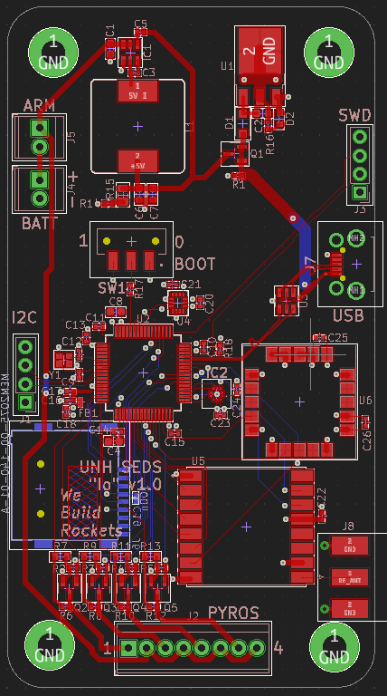
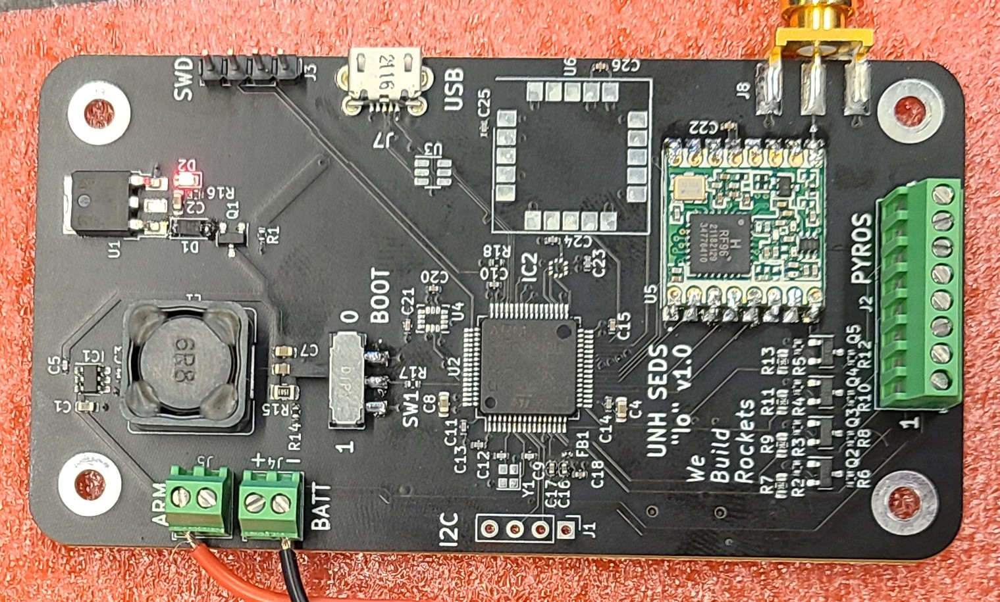

# Io
A simple high-powered rocket altimeter and flight computer, developed for UNH SEDS, appropriately named after both the moon of Jupiter as well as I/O. Io features a custom-designed PCB (made with the help of guides at [Phils Lab](https://www.phils-lab.net/)). This repository contains the board designs, firmware source, and some simple avionics bay (avbay) models

# Purpose
The flight computer is designed to monitor the altitude of a high-powered rocket, triggering ejection charges at set points in the flight profile (typically a drogue chute at apogee, and a main chute at 1000ft AGL). Additionally, the computer is meant to instrumentation data to an SD card, and transmit telemetry to a ground station over a 915MHz LoRA link provided by a RFM95W module. Firmware is currently in-progress, but the board has been fabricated, and all components besides some instruments have been installed.

<figure style="width: 30%; display: inline-block;">

<figcaption align="center"><b>Designs for PCB</b></figcaption>
</figure>

<figure style="width: 30%; display: inline-block;">

<figcaption align="center"><b>Production board, powered on</b></figcaption>
</figure>

# Todo
- Finish initial firmware
- Implement and test telemetry link
- Implement altimeter instrumentation and ejection charge events
- Log to SD card
- Implement gyroscope/accelerometer measurements and state estimation

# Todo for Board v2.0
- Strict 3.3v linear power regulation (sorry, buck converter)
- Better external interface connectors
- IO wire for serial debug printf (no more breakpoints)
- Battery level monitoring
- Buzzer for audible feedback
- Ground connection for arming switch
- Reverse-voltage protection on pyros
- Integrated pyro resistors
- Neater PCB layout
